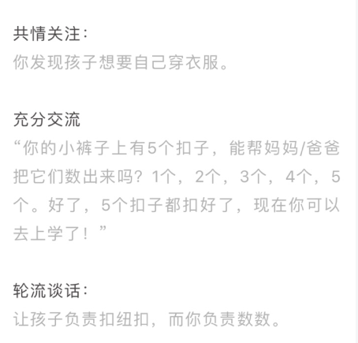
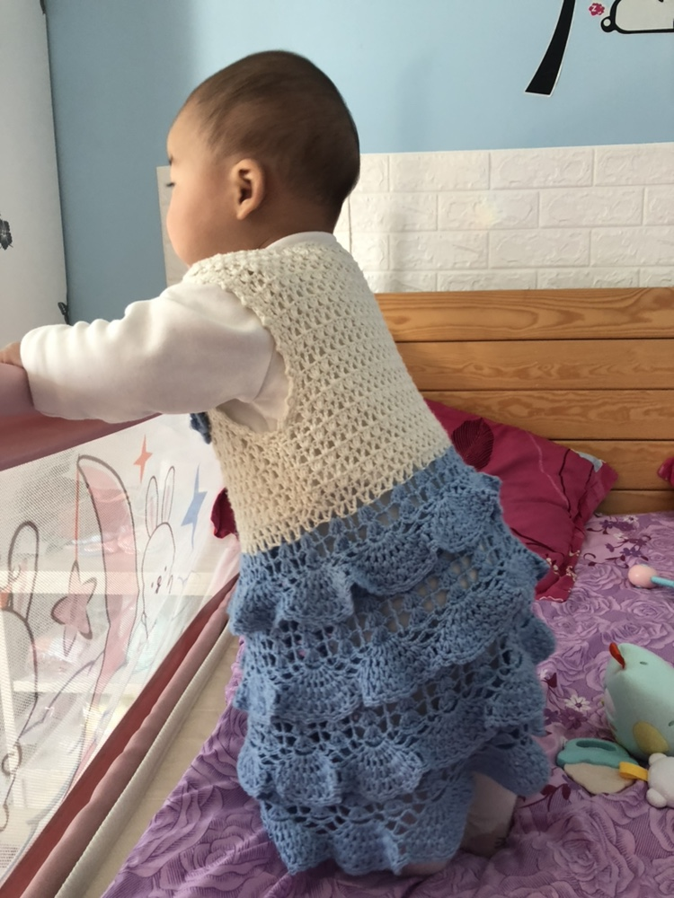

> 日子过得太快了，不写些什么，过去就过去了。一周太频繁，一年太空泛，一个月试试看能不能坚持下来。

### 工作
- 问题小结
1. [react-router 4.0 的非组件跳转](https://chenam.github.io/post/react-router-4-0-%E7%9A%84%E9%9D%9E%E7%BB%84%E4%BB%B6%E8%B7%B3%E8%BD%AC)
2. [vue 微信引导下载思路](https://chenam.github.io/post/vue-%E5%BE%AE%E4%BF%A1%E5%BC%95%E5%AF%BC%E4%B8%8B%E8%BD%BD%E6%80%9D%E8%B7%AF)

### 阅读

樊登读书会（听书） 
1. 《父母的语言》
> “3T”原则法
这本书最重要的价值是告诉父母应该怎样和孩子对话，才能最大化地激发其大脑潜能即“3T”原则法：
共情关注（Tune in）：共情关注你的孩子在做什么
充分沟通（Talk more）：与孩子讨论时使用大量的描述性词语
轮流谈话（Take turns）：和孩子轮流参与谈话

我希望我像导游一样，为刚来这个世界的宝宝介绍这个世界。1. 多说 2. 数字词汇输入 3.因果思维

### 英语学习
想把英语拾起来，但是这个月只坚持了10天，希望下一期可以坚持下来

### 小朋友

小朋友马上要8个月了，这个月她学会了坐，可以很快很快地爬，可以在床上扶着床围摇摇晃晃地站起来    
她开始有自己的想法，摸摸这个，拍拍那个
喜欢玩水，不喜欢坐在餐椅里吃饭
她开始认识我，要我抱抱，尽管她越来越重，我抱的越来越吃力
她开始吃越来越复杂的东西，草莓面条肉泥。
发的音也越来越多，pupupu,bababa,自言自语。虽然一句也听不懂，肢体加上表情，越来越明白她要干什么。

