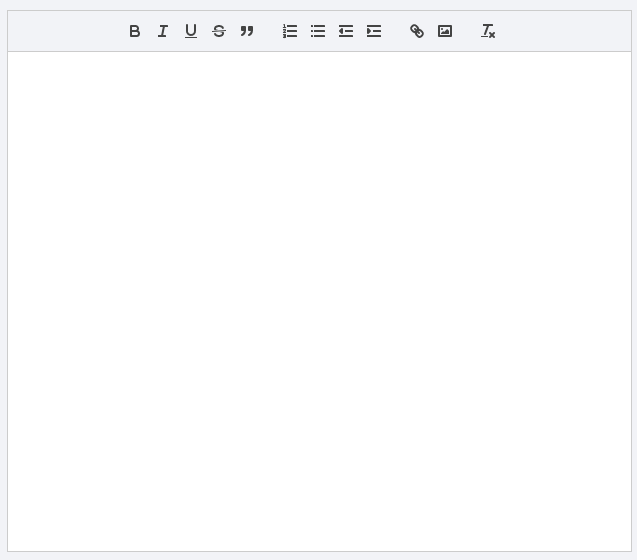

### 用的是react-quill , 颜值如图



### 使用方法
- 引入

```
npm install react-quill --save

import ReactQuill from 'react-quill'; 
import 'react-quill/dist/quill.snow.css';
```

```
// 富文本的记录
handleChange(value){
    this.setState({
        richValue : value
    })
}

// 富文本toolbar
const modules = {
    // theme: 'snow',
    toolbar: {
        container: [
            ['bold', 'italic', 'underline', 'strike', 'blockquote'],
            [{'list': 'ordered'}, {'list': 'bullet'}, {'indent': '-1'}, {'indent': '+1'}],
            ['link', 'image'],
            ['clean']
        ],
        handlers: {
            'image': self.imageHandler
        }
    }
    
};

<ReactQuill 
    value={richValue} 
    onChange={this.handleChange.bind(this)} 
    modules={modules}
    className='qrill-main'
    ref={(el) => this.quillRef = el}
/>

```

- 重难点在于富文本内的图像上传

```

// 触发上传
imageHandler(image, callback){
    const self = this;
    if(image){
        const input = document.createElement('input');
        input.setAttribute('type', 'file');
        input.click();

        // Listen upload local image and save to server
        input.onchange = () => {
            const file = input.files[0];

            // file type is only image.
            let bool = _this.beforeUpload(file);

            if(bool){
                _this.saveToServer(file);
            };
        };
    }

}

// 上传到服务端
saveToServer(file){
    const self = this;
    http.postAsFormData('XXX',{
        file : file
    }).then((res) => {
        if(res && res.status === 'succeed'){
            self.insertToEditor(res.uploadRsp.accessUrl)
        } else{

        }
    });
}

// 替换文件
insertToEditor(url){
    const range = this.quillRef.getEditor().getSelection();
    this.quillRef.getEditor().insertEmbed(range.index, 'image', url);
}

// 图片校验
beforeUpload(file,allType = ['jpg','png','jpeg'],maxSize=5, type) {
    let fileType = file.type;
    let { name } = file;
    if (!fileType) {
        fileType = name.split('.').pop();
    } else {
        fileType = fileType.split('/')[1];
    }
    const isJPG = allType.indexOf(fileType) > -1;
    if (!isJPG) {
        message.error('请上传正确的格式！');
        return false;
    }
    const isLt3M = file.size / 1024 / 1024 < maxSize;
    if (!isLt3M && isJPG) {
        message.error(`上传图片必须小于${maxSize}M!`);
        return false;
    }
    let isSuccess = isJPG && isLt3M;
    return  isSuccess;
}
```