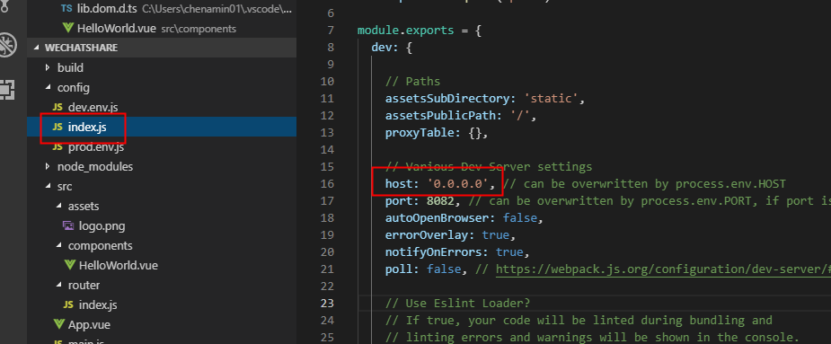
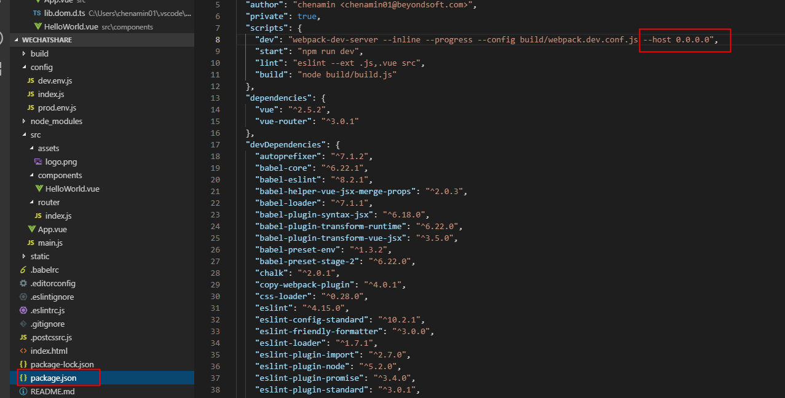

- 移动端访问用 vue-cli 起的项目       
用vue-cli起了项目以后，扫ip地址，访问不到

只要改这两个地方就可以了
1. 把config/index.js文件中默认的localhost 改成 0.0.0.0
2. 修改package.json中script下dev的值，在后面加入–host 0.0.0.0




- 代码
```
<template>
  <div id="app">
    <router-view/>
    <div 
        class="mask" 
        v-show="isShowMask" 
        @click="maskClick" 
        @touchmove.prevent
    ></div>
    <a href="javascript:;" @click="btnClick">点击跳转</a>
  </div>
</template>

<script>
export default {
  name: 'App',
  data () {
    return {
      isShowMask: false,
      isWexin: false
    }
  },
  created () {
    var WxObj = window.navigator.userAgent.toLowerCase()
    // 是否是微信浏览器
    if (WxObj.match(/microMessenger/i) == 'micromessenger') {
      this.isWexin = true
    } else {
      this.isWexin = false
    }
    if (!this.isWexin) {
      window.location.href = '地址'
    }
  },
  methods: {
    btnClick () {
      if (this.isWexin) {
        this.isShowMask = true
      } else {
        window.location.href = '地址'
      }
    },
    maskClick () {
      this.isShowMask = false
    }
  }
}
</script>

<style>
<!-- 样式 -->
.mask{
    width: 100%;
    height: 100vh;
    position: fixed;
    left: 0;
    top: 0px;
    background: rgba(0,0,0,0.5);
    z-index: 2;
}
</style>
```